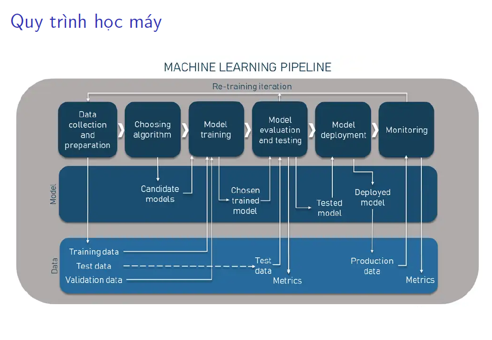

# HỆ THỐNG CHỐNG GIAN LẬN

## I. Mục tiêu hệ thống
 - Phát hiện giao dịch gian lận trong thời gian thực với độ trễ tối thiểu
 - Phân tích hành vi, IP, vị trí, thiết bị, lịch sử giao dịch...
 - Có khả năng cảnh báo, tạm dừng, hoặc từ chối giao dịch.
 - Dễ tích hợp với hệ thống ngân hàng hiện tại.
## II. Kiến trúc tổng thể

## III. Thành phần chi tiết
### 1. DataSource - Nguồn dữ liệu
- Database giao dịch
- Log WebServer (nginx)
- Log ứng dụng (thu thập qua ELK stack: Elasticsearch, Logstash, Kibana)
- Dữ liệu hành vi người dùng (clickstream, hành vi thiết bị, IP, vị trí...)

### 2. Apache Kafka
- Change Data Capture (CDC): Debezium giúp phát hiện thay đổi dữ liệu trong DB realtime, stream dữ liệu vào Kafka topic.
- Kafka Connect: Kết nối với các hệ thống dữ liệu khác nhau, đồng bộ và xử lý luồng dữ liệu liên tục.

### 3. Rule-based Engine
- Graylog: Nền tảng quản lý và phân tích log. Gần thời gian thực nhưng vẫn truy vấn. Thu thập, phân tích log, phát hiện các pattern gian lận dựa trên luật định sẵn. Xử lý những dữ liệu dạng không có ngữ cảnh (không có lưu trữ)
    - Giao dịch liên tiếp thất bại trong thời gian ngắn
    - Số lượng lỗi xác thực vượt mức trong 1 phút.
    - Số lượng giao dịch lớn từ một tài khoản 
    - Tổng giao dịch vượt ngưỡng cho phép
    
- Apache Flink: Nền tảng xử lý dữ liệu stream phức tạp. Xử lý luồng dữ liệu thời gian thực, đánh giá các quy tắc phức tạp, phát hiện gian lận theo chuỗi sự kiện. Xử lý những dữ liệu dạng có ngữ cảnh (có lưu trữ)
  - Người dùng đăng nhập ở một quốc gia lạ, bình thường ở VN, nay lại đăng nhập ở Mỹ
  - Người dùng mới đăng ký, thực hiện giao dịch lớn ngay lập tức
  - Phát hiện giao dịch theo chuỗi hành vi bất thường: giao dịch số tiền nhỏ, sau đó tăng dần
  - Phát hiện giao dịch từ IP hoặc thiết bị mới (dựa trên trạng thái lưu trữ).
  
### 4. ML Engine

- Chuẩn bị dữ liệu cho mô hình học máy:
  - Thu thập dữ liệu
  - Chuyển đổi dữ liệu
  - Làm sạch dữ liệu
  - Chia dữ liệu
- Khó khăn
  - Thiếu dữ liệu
  - Dữ liệu bị nhiễu
  - Tạo đặc trưng phù hợp
  - Bảo vệ thông tin nhạy cảm
  - Quản lý phiên bản dữ liệu
#### 4.1 Supervised Learning (Học có giám sát)
- Dữ liệu đầu vào là các giao dịch đã được gắn nhãn rõ ràng: giao dịch hợp lệ hoặc giao dịch gian lận.
- Mô hình sẽ học cách phân biệt các đặc điểm của giao dịch gian lận từ dữ liệu đã biết.
#### 4.2 Unsupervised Learning (Học không giám sát)
- Thường dùng khi chưa có hoặc ít dữ liệu nhãn về gian lận.
- Mô hình sẽ phân nhóm các giao dịch dựa trên đặc điểm tương đồng.
- Các giao dịch nằm ngoài nhóm phổ biến hoặc ở nhóm lạ có thể được xem là khả nghi.
#### 4.3 Reinforcement Learning (Học tăng cường)
- Mô hình học cách đưa ra quyết định tối ưu nhất dựa trên trạng thái hiện tại và phản hồi từ môi trường.

### 5. Alert System
- Hệ thống cảnh báo tự động gửi thông báo đến bộ phận quản lý, đội kiểm soát rủi ro hoặc khách hàng.
- Gửi email, SMS, push notification hoặc tích hợp với hệ thống giám sát nội bộ.

### 6. Fraud Action Handler
- Tạm khóa giao dịch đang nghi ngờ
- Từ chối giao dịch nếu mức rủi ro vượt ngưỡng cho phép
- Gắn flag giao dịch nghi ngờ để kiểm tra thủ công hoặc theo quy trình phê duyệt.

### 7. Data Lake
- Lưu trữ dữ liệu giao dịch, hành vi, kết quả phát hiện gian lận để phục vụ phân tích, báo cáo và huấn luyện lại mô hình.

### 8. API Gateway / Integration Layer
- Cung cấp API để hệ thống ngân hàng gọi vào để kiểm tra, cảnh báo hoặc tạm dừng giao dịch.
- Hỗ trợ webhook để gửi cảnh báo hoặc trạng thái giao dịch cho các hệ thống bên ngoài.